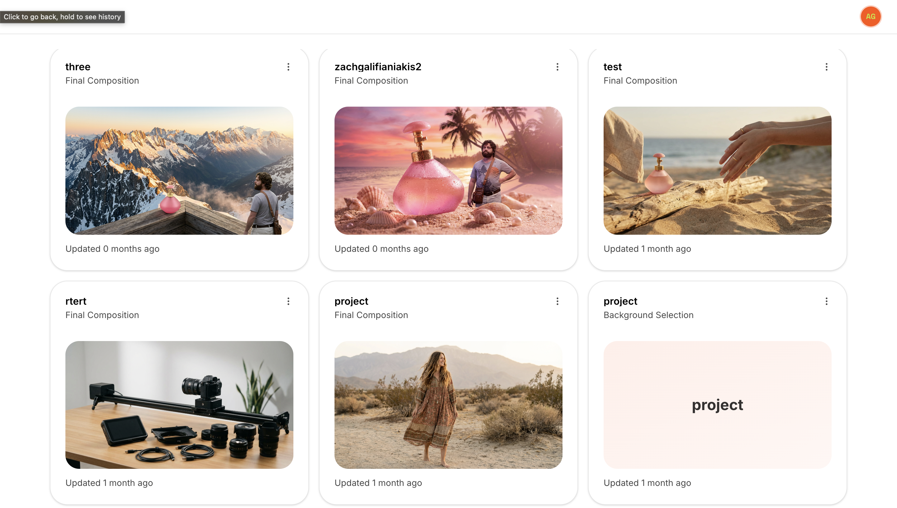
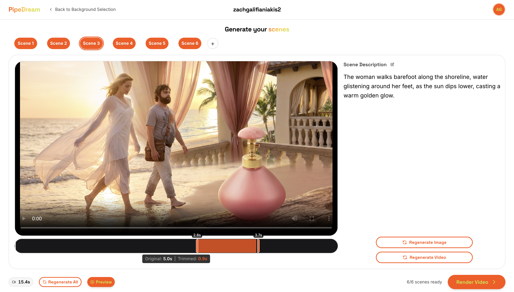

# AI Video Generation Pipeline

A project-based AI video generation pipeline that transforms product vision into character & scene-consistent ads.

| Projects Dashboard | Scene Storyboard |
|:------------------:|:----------------:|
|  |  |

## Tech Stack

**Frontend:** Next.js 16, TypeScript, Firebase Auth & Firestore, Tailwind CSS, shadcn/ui, Zustand, Vercel AI SDK

**Backend:** FastAPI (Python 3.11+), Firestore, Replicate API, FFmpeg, OpenAI API

## Basic Flow

1. Projects Dashboard - Create and manage video projects
2. Vision & Brief - Conversational AI to capture video concept
3. Mood Selection - Choose from AI-generated mood boards
4. Scene Storyboard - Progressive generation (text → image → video)
5. Final Composition - Generate complete video with audio

## How to Run

### Prerequisites
- Node.js 18+ and pnpm
- Python 3.11, 3.12, or 3.13
- FFmpeg installed
- Firebase project with Authentication and Firestore enabled

### Setup

1. **Install dependencies:**
   ```bash
   pnpm install
   cd frontend && pnpm install
   cd ../backend
   python3.13 -m venv venv  # or python3.12, python3.11
   source venv/bin/activate
   pip install -r requirements.txt
   ```

2. **Configure Firebase:**
   - Download service account key → save as `backend/serviceAccountKey.json`
   - Get Firebase web config → add to `frontend/.env.local`

3. **Set environment variables:**

   **Backend** (`backend/.env`):
   ```env
   REPLICATE_API_TOKEN=your_token
   OPENAI_API_KEY=your_key
   CORS_ORIGINS=http://localhost:3000
   API_BASE_URL=http://localhost:8000
   ```

   **Frontend** (`frontend/.env.local`):
   ```env
   NEXT_PUBLIC_API_URL=http://localhost:8000
   NEXT_PUBLIC_FIREBASE_API_KEY=your_key
   NEXT_PUBLIC_FIREBASE_AUTH_DOMAIN=your-project.firebaseapp.com
   NEXT_PUBLIC_FIREBASE_PROJECT_ID=your-project-id
   NEXT_PUBLIC_FIREBASE_STORAGE_BUCKET=your-project-id.appspot.com
   NEXT_PUBLIC_FIREBASE_MESSAGING_SENDER_ID=your_sender_id
   NEXT_PUBLIC_FIREBASE_APP_ID=your_app_id
   ```

### Run

```bash
# From root directory - runs both frontend and backend
pnpm dev
```

- Frontend: http://localhost:3000
- Backend: http://localhost:8000
